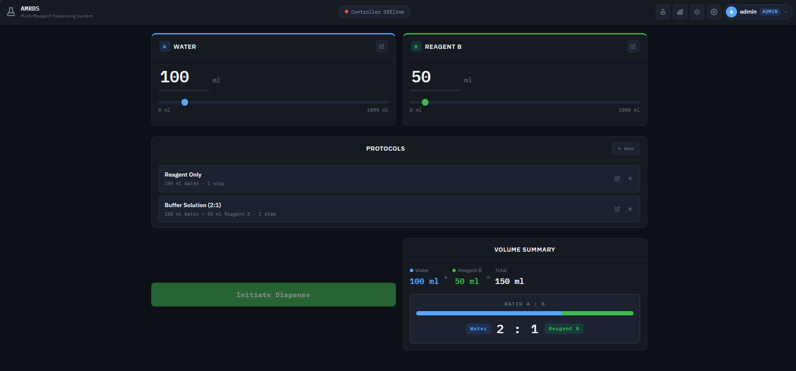
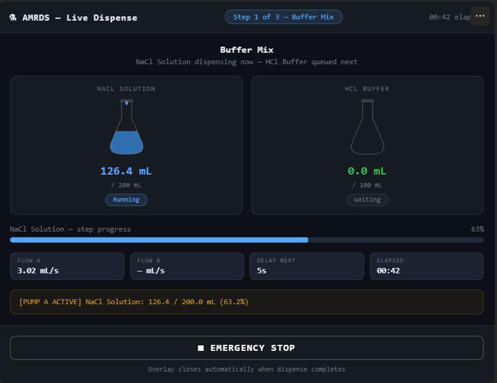
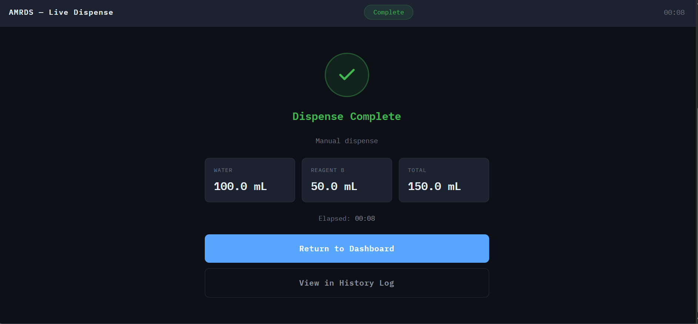
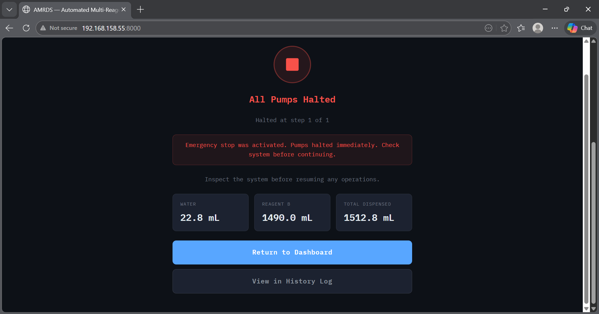
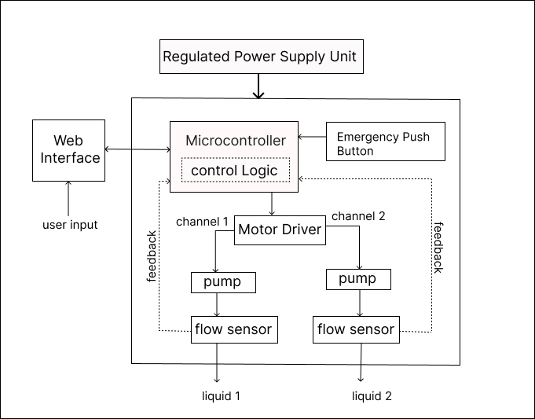
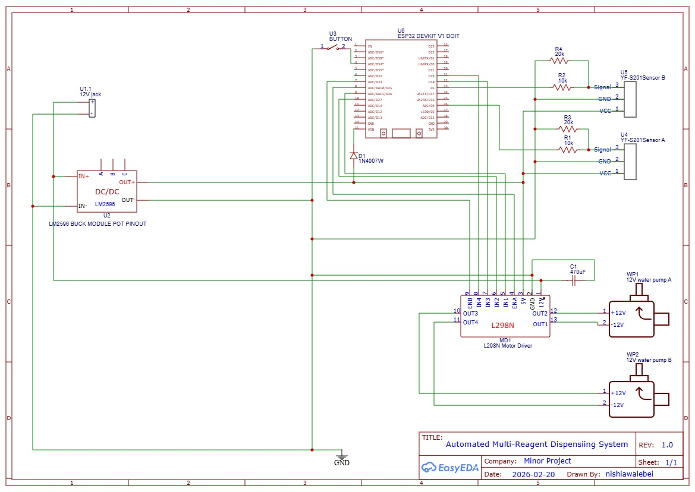
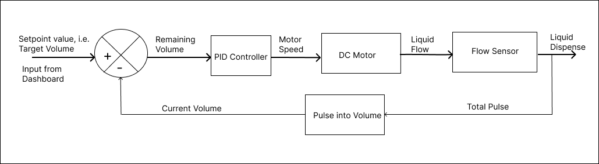

# AMRDS — Automated Multi-Reagent Dispensing System

A laboratory automation system designed to eliminate manual errors in reagent handling by enabling precise, automated dispensing with real-time monitoring and a web-based control interface.

---

## Overview

**AMRDS (Automated Multi-Reagent Dispensing System)** is an IoT-enabled laboratory instrument designed to deliver precise and automated dispensing of multiple reagents. The system utilizes PID-controlled peristaltic pumps to ensure accuracy, consistency, and repeatability in liquid handling processes.

A Flask-based web application serves as the control interface, offering real-time dispensing progress, user authentication, and comprehensive logging for monitoring and traceability. The integration of hardware and software enables efficient, reliable, and user-friendly operation tailored for modern laboratory environments.

This project has been developed as part of the **Minor Project** for the **Bachelor in Electronics, Communication, and Information Engineering (6th Semester)**.

---

## System Architecture

The system consists of three main components:

1. **ESP32 Firmware** — Handles real-time control of pumps, sensors, and PID logic  
2. **Flask Backend** — Processes requests, manages users, and logs system data  
3. **Web Interface** — Provides user interaction, monitoring, and visualization  

**Communication Flow:**

```
Web Interface ⇄ Flask Server ⇄ ESP32
```

---

## Team Members

- Maansh Baral  
- Nishi Awale  
- Sadhana Shrestha  

---

## Features

### Hardware

The system integrates the following hardware components:

- **Dual Pump Control** — Independent control of Reagent A and Reagent B with precise flow measurement  
- **Flow Sensors** — Hall-effect flow sensors for real-time volume tracking  
- **PID Control** — Closed-loop feedback for accurate dispensing  
- **Emergency Stop** — Hardware-level emergency stop button  
- **WiFi Connectivity** — ESP32-based wireless communication  

### Software

The software layer provides the following capabilities:

- **Web Interface** — Modern Flask-based dashboard for system control  
- **User Authentication** — Role-based access control (Admin/Operator)  
- **Protocol Management** — Create and save custom dispensing protocols  
- **Inventory Tracking** — Monitor reagent levels with low-level warnings  
- **Complete Logging** — All dispensing operations logged with timestamps  
- **Analytics** — View dispensing history and statistics  

---

## User Interface Preview

  
*Main dashboard showing system overview*

  
*Real-time dispensing progress interface*

  
*Completed operation summary*

  
*Emergency halt interface*

| Feature | Description |
|---------|-------------|
| Real-time Progress | Live dispensing progress with volume tracking |
| Protocol Editor | Create and manage multi-step dispensing protocols |
| History Log | Searchable log of all dispensing operations |
| Analytics | Charts showing dispensing statistics and trends |
| Inventory | Monitor reagent levels with low-level alerts |

---

## Hardware Specifications


*Hardware System Block Diagram*
### ESP32 Pin Configuration

| Component | GPIO Pins | Description |
|-----------|-----------|-------------|
| Pump 1 (Reagent A) | IN1=26, IN2=27, EN=25 | LEDC Channel 0 |
| Pump 2 (Reagent B) | IN1=18, IN2=19, EN=33 | LEDC Channel 1 |
| Flow Sensor 1 | GPIO 4 | FALLING interrupt |
| Flow Sensor 2 | GPIO 5 | FALLING interrupt |
| Emergency Button | GPIO 34 | INPUT_PULLUP, active LOW |

### Calibration Parameters

| Parameter | Pump 1 | Pump 2 |
|-----------|--------|--------|
| Pulses per Litre | 394.8 | 400.0 |
| Debounce | 5 ms | 80 ms |
| PID Kp | 2.9 | 2.9 |
| PID Ki | 0.04 | 0.04 |
| PID Kd | 3.0 | 3.0 |

> ⚠️ **Note**: These calibration values are specific to the hardware used in this project. Different pumps, flow sensors, or tubing configurations may require different values. Refer to the Calibration Guide section for details.

---

## Circuit Diagram


*Circuit Connection*
---

## PID Control Explanation

The AMRDS uses a **PID (Proportional-Integral-Derivative) controller** for precise flow control.

Output(t) = Kp·e(t) + Ki∫e(t)dt + Kd·de(t)/dt

Where:
- `e(t)` = Error (target volume − dispensed volume)  
- `Kp` = Proportional gain  
- `Ki` = Integral gain  
- `Kd` = Derivative gain  

### PID Components

| Component | Role | Effect |
|-----------|------|--------|
| **P (Proportional)** | Responds to current error | Fast response, but may cause oscillation |
| **I (Integral)** | Accumulates past errors | Eliminates steady-state error |
| **D (Derivative)** | Predicts future error | Dampens oscillations |

### Tuning Parameters Used

| Parameter | Value | Purpose |
|-----------|-------|---------|
| Kp | 2.9 | Primary response to error |
| Ki | 0.04 | Eliminates residual error |
| Kd | 3.0 | Prevents overshoot |

### Deadband

A deadband of **15 mL** is implemented to prevent pump oscillation near the target volume, ensuring stable final dispensing.

### Flow Control Loop



---

## Project Structure

```
Minor-Project/
├── hardware/
│   ├── platformio.ini
│   └── src/
│       └── main.cpp
│
├── software/
│   ├── app.py
│   ├── requirements.txt
│   ├── static/
│   │   ├── css/
│   │   │   └── style.css
│   │   └── js/
│   │       └── script.js
│   └── templates/
│       ├── index.html
│       └── login.html
│
└── README.md
```

---

## Installation

### Prerequisites

- Python 3.x  
- PlatformIO  
- ESP32 development board  

---

### Hardware Setup

1. Install PlatformIO for ESP32 development  
2. Configure WiFi credentials in `hardware/src/main.cpp`:

```cpp
const char* WIFI_SSID  = "your_wifi_ssid";
const char* WIFI_PASS  = "your_wifi_password";
const char* FLASK_HOST = "flask_server_ip";
const int   FLASK_PORT = 8000;
```

3. Build and upload the firmware to ESP32  

---

### Software Setup

1. Navigate to the software directory:

```bash
cd software
```

2. Create a virtual environment (recommended):

```bash
python -m venv venv
source venv/bin/activate
venv\Scripts\activate
```

3. Install dependencies:

```bash
pip install -r requirements.txt
```

4. Configure ESP32 IP address in `app.py`:

```python
ESP32_IP = "your_esp32_ip_address"
```

5. Run the application:

```bash
python app.py
```

6. Access the web interface at:

```
http://localhost:8000
```

---

## Default Credentials

| Role | Username | Password |
|------|----------|----------|
| Admin | admin | admin123 |

> ⚠️ **Security Note**: Change the default admin password in production.

---

## API Endpoints

The system uses REST-based communication between ESP32 and Flask.

### ESP32 → Flask

| Endpoint | Method | Description |
|----------|--------|-------------|
| `/esp32/heartbeat` | POST | ESP32 heartbeat (every 2s) |
| `/update-progress` | POST | Real-time dispensing progress |
| `/complete` | POST | Sequence completion notification |

### Flask → ESP32

| Endpoint | Method | Description |
|----------|--------|-------------|
| `/start` | GET | Start dispensing |
| `/stop` | GET | Emergency stop |
| `/complete` | GET | Request completion status |
| `/ping` | GET | ESP32 health check |

---

## Usage Guide

### Starting a Dispensing Operation

1. Log in to the web interface  
2. Enter target volumes for Reagent A and Reagent B  
3. Click "Start Dispensing"  
4. Monitor real-time progress  

### Creating a Protocol

1. Navigate to the Protocols section  
2. Click "New Protocol"  
3. Define steps with reagent volumes  
4. Save the protocol  

### Viewing History

1. Access the History tab  
2. Filter by date range  
3. View detailed logs  

---

## Technology Stack

| Layer | Technology |
|-------|------------|
| Hardware | ESP32, Peristaltic Pumps, Flow Sensors |
| Firmware | Arduino / ESP-IDF |
| Backend | Flask (Python) |
| Database | SQLite |
| Frontend | HTML, CSS, JavaScript |

---

## Calibration Guide

### Understanding Calibration Parameters

| Parameter | Description | Adjustment |
|-----------|-------------|-----------|
| PULSES_PER_LITRE | Pulses per litre of fluid | Measure actual pulses |
| DEBOUNCE | Filters sensor noise | Increase if unstable |
| PID Kp/Ki/Kd | Control tuning | Adjust experimentally |
| DEADBAND_ML | Stop threshold | Tune for stability |

### Calibration Procedure

1. Measure known volume  
2. Calculate pulses per litre  
3. Tune PID parameters  
4. Adjust debounce  

> 📝 **Tip**: Document calibrated values for future reference.

---

## Future Improvements

- Support for more than two reagents  
- Cloud-based monitoring and remote access  
- Mobile application interface  
- Automatic PID tuning  
- Integration with laboratory systems  

---

## License

This project is for educational and research purposes.

---

## Acknowledgments

- ESP32 Arduino framework  
- Flask web framework  
- Open-source libraries used in this project  